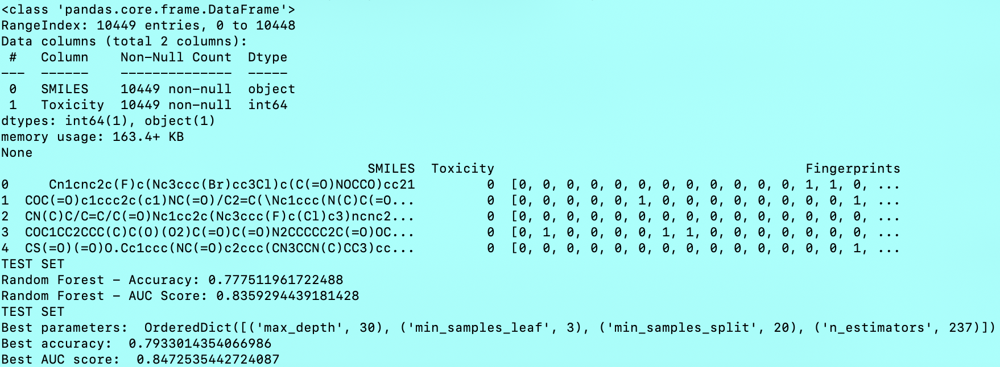

# ToxiPredict
This is a small project that incorporates AI-based approaches and extended chemical space exploration to predict the toxicity of any organic molecules.

In this example, we developed a small Random Forest model (optimized using Bayesian Optimization) that learns how to predict the toxicity of new organic molecules generated through a combinatorial approach.

## Prerequisites

### Anaconda

To execute the code, we will set up a specific environment using Anaconda. To install it, visit [Anaconda Installation](https://docs.anaconda.com/free/anaconda/install/).

### Setup conda environment

First, create the conda environment:
```
conda create -n ToxiPredict python=3.8
```

Then, activate the conda environment:
```
conda activate ToxiPredict
```

Once the environment is properly created, install the necessary Python libraries to execute the code:
```
conda install -c conda-forge rdkit pandas numpy scikit-learn scikit-optimize
```
```
pip install joblib
```

## Project architecture

The project is divided into three parts:
1. **Building and training an AI-based model to predict the toxicity of organic molecules**  
2. **Generating new random molecules based on already existing organic molecules**  
3. **Applying the AI model to these new molecules**  

### Build and Train an AI-based Model to Predict Toxicity of Organic Molecules

The project begins by building and training an AI-based model that predicts the toxicity of any organic molecule, which is the core of this project. We implemented the following pipeline within the [RandomForest_with_BO.py](RandomForest_with_BO.py) file:  
**1.1**  We utilized an existing database from the work of Setyia et al. ([https://jcheminf.biomedcentral.com/articles/10.1186/s13321-021-00566-4](https://www.ncbi.nlm.nih.gov/pmc/articles/PMC10826801/)), referred to here as [SMILES_and_toxicity.csv](SMILES_and_toxicity.csv). A label of 0 indicates that the molecule is non-toxic, while 1 indicates toxicity.
**1.2**  We load the data and convert each SMILES into a fingerprint using Morgan Fingerprints available in RDKit (https://www.rdkit.org/docs/GettingStartedInPython.html)  
**1.3**  The data must be uniform in size and are then used to train a simple Random Forest model with initial hyperparameters. 
**1.4**  The hyperparameters are then optimized using Bayesian Optimization (BO, https://scikit-optimize.github.io/stable/auto_examples/bayesian-optimization.html)  
**1.5**  The model is finally saved into an external file named [my_random_forest_model.joblib](my_random_forest_model.joblib)  

```
python RandomForest_with_BO.py
```

<figure>
  
  <figcaption>Screenshot after the execution of the script. We obtained a success rate of 79% in our predictions on the test set.</figcaption>
</figure>

### Generate New Random Molecules Based on Already Existing Organic Molecules

Once the model is saved, we use the already existing SMILES stored in [SMILES_and_toxicity.csv](SMILES_and_toxicity.csv) to create a new set of organic molecules to test our model. We employed the BRICS approach implemented in RDKit to fragment the SMILES and stored them in a new external file. We then randomly recombined them to create a new set of random molecules. For more details, see the directory [Generate_SMILES](Generate_SMILES)

### Apply the AI Model to These New Molecules

The new molecules where we can test the code are stored in the [Generate_SMILES/smiles_generated.csv](Generate_SMILES/smiles_generated.csv) file. We can finally use the script [Predict_toxicity.py](Predict_toxicity.py) to determine if the newly generated molecules are toxic or not.

```
python Predict_toxicity.py
```

<figure>
  
  <figcaption>Screenshot after the execution of the script.</figcaption>
</figure>

## Conclusions

This small project was designed to demonstrate how AI and combinatorial approaches for database curation can be used to tackle biochemical issues. This project will be enhanced in the future, for instance by adding more constraints in the SMILES generation or by including more properties to predict (such as stability or solubility) using other models that can be combined together at the end during the prediction process.


